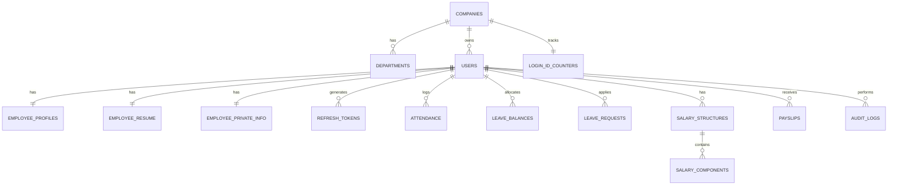

# Dayflow HRMS (v2)

Dayflow is a secure, multi-tenant Human Resource Management System (HRMS) built from scratch as a single standalone workspace. It features a complete PostgreSQL-backed database schema, a modular Express TypeScript API server, and a premium React (Vite + TypeScript + Tailwind CSS) client dashboard.

---

## 1. Setup & Running Instructions

### System Prerequisites
- **Node.js**: `v24.19.0` or higher
- **npm**: `v11.17.0` or higher
- **Database**: Runs out-of-the-box using `@electric-sql/pglite` (embedded WebAssembly PostgreSQL 16) with persistent disk storage under `./db/pglite`. Set `PGLITE_DATA_DIR` to override the embedded database path, or set `DATABASE_URL` to use an external server.

### Installation Steps

1. **Clone the repository** and navigate to the project root.
2. **Install dependencies** for both the server and client:
   ```bash
   # Build Server
   cd server
   npm install
   
   # Build Client
   cd ../client
   npm install
   ```

3. **Database Seeding**:
   Initialize schema migrations, triggers, views, and generate dummy records:
   ```bash
   cd ../server
   npm run seed
   ```
   *Note: This creates "Odoo India" workspace, 1 admin, 2 departments, 6+ employees across 2025/2026 years, leave requests, attendance logs, salary structures, and payslips.*

4. **Running Locally**:
   Start both backend and frontend servers:
   ```bash
   # Start Express API Server (runs on http://localhost:5000)
   cd server
   npm run dev

   # Start Vite React Client (runs on http://localhost:5173)
   cd ../client
   npm run dev
   ```

---

## 2. Entity Relationship Diagram (ERD)

Dayflow uses a highly normalized multi-tenant relational schema:



- **Encryption at rest**: PII fields (`bank_account_number_enc`, `pan_number_enc`, `aadhar_number_enc` in `employee_private_info` table) are encrypted using AES-256-GCM.

---

## 3. Real-time Notifications

- The notification bell in the top navigation shows unread activity and opens a notification drawer.
- Attendance check-ins/check-outs and leave requests are broadcast to the company. Leave approvals and rejections are sent to the affected employee.
- Notification messages include employee names and leave types where applicable.
- Use **Mark all read** or **Clear all** in the drawer to manage messages. The latest 50 notifications are saved per user in browser `localStorage` and remain after a refresh.

### PGlite storage

By default, the embedded database is stored in `./db/pglite` (not `./db/storage`). To place it elsewhere, set `PGLITE_DATA_DIR` before starting the server:

```bash
PGLITE_DATA_DIR=./my-data npm run dev
```

Set `DATABASE_URL` instead when using an external PostgreSQL database.

---

## 4. Login ID Algorithm worked example

Every employee joining the workspace receives a generated ID matching:
`[CompanyPrefix][NameInitials][JoiningYear][Serial]`

### Steps to compute ID:
1. **CompanyPrefix**:
   - First letter of first two words of company name.
   - Example: `"Odoo India"` → `O` + `I` = `OI`.
2. **NameInitials**:
   - First two letters of first name + first two letters of last name.
   - Example: `"John Doe"` → `JO` + `DO` = `JODO`.
3. **JoiningYear**:
   - 4-digit year.
   - Example: `2026`.
4. **Serial**:
   - Zeros-padded 4-digit atomic incrementing serial number per company per year.
   - Example: `0002` (resets to `0001` every calendar year).

**Generated Result**: `OIJODO20260002`
